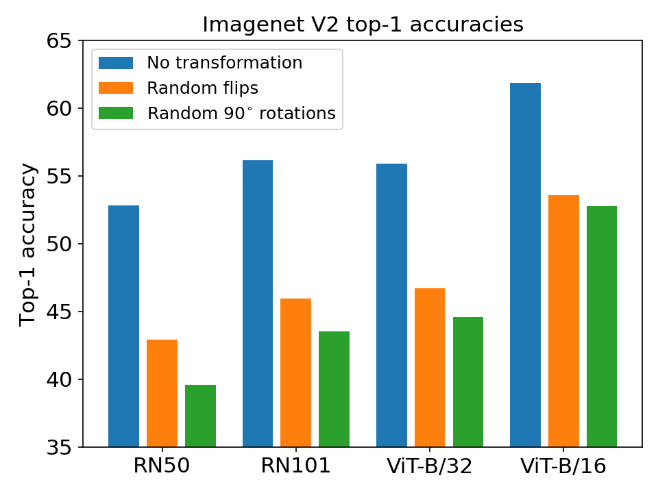
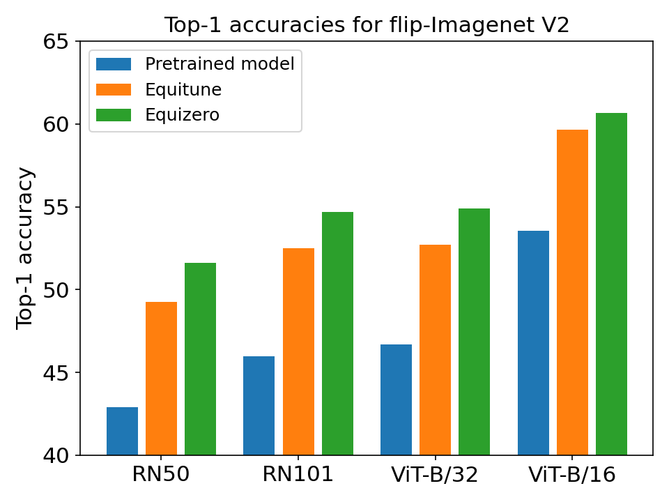
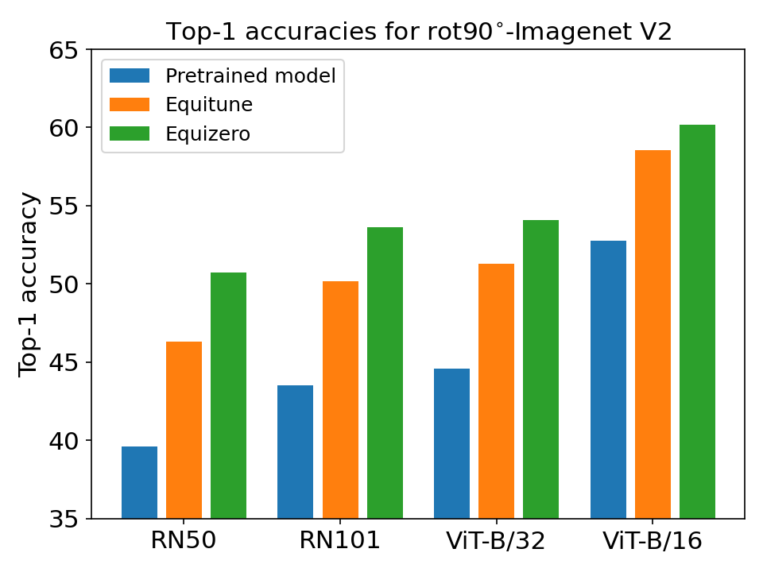
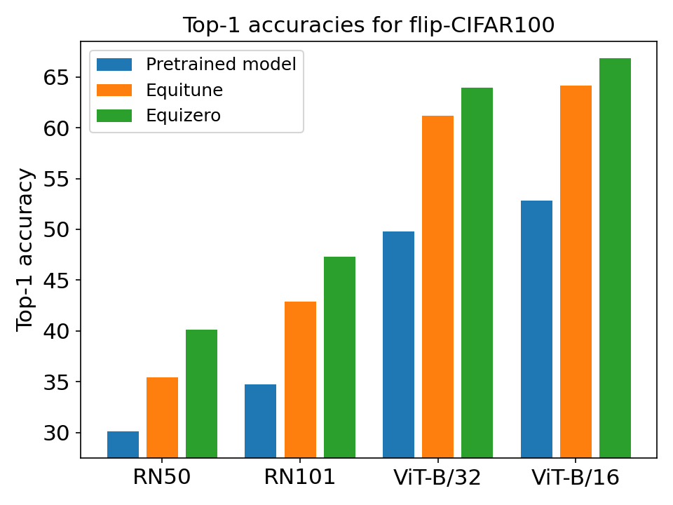
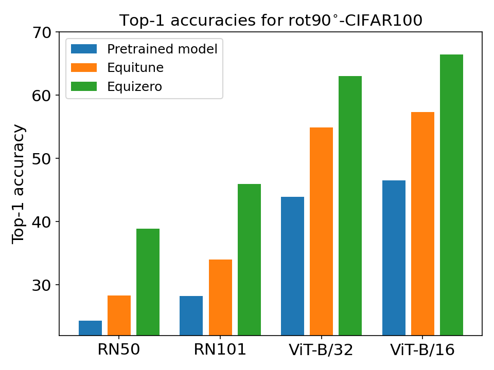
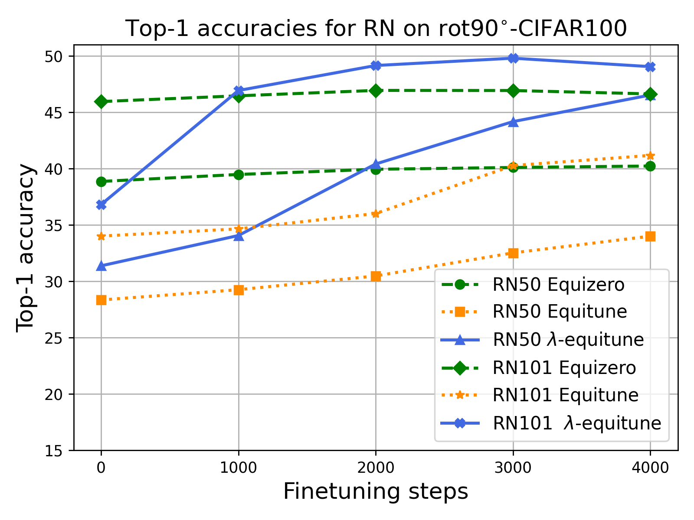
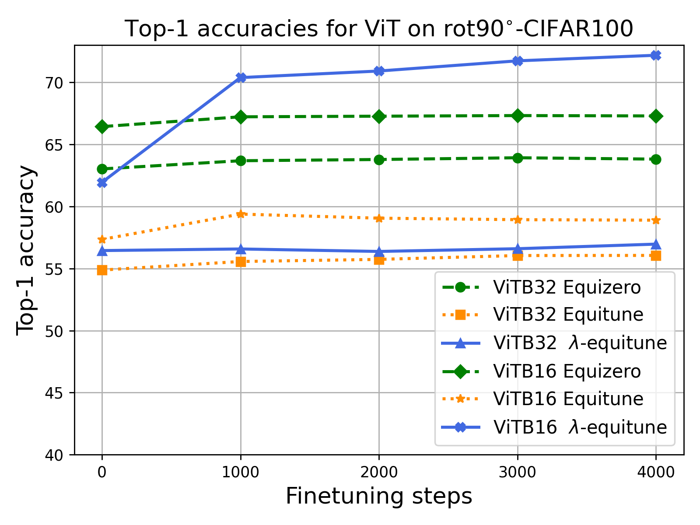
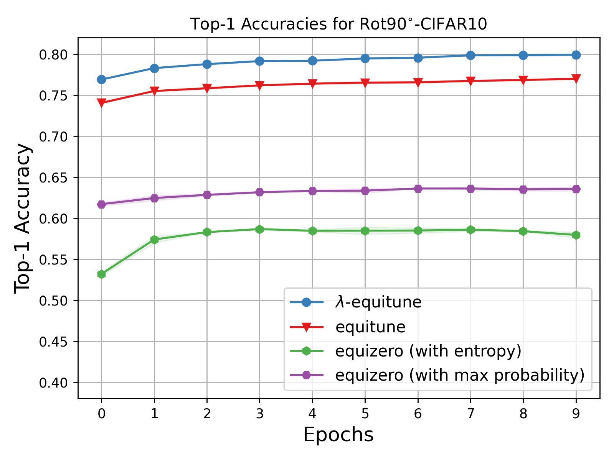

Code for "Efficient Equivariant Transfer Learning from Pretrained Models", NeurIPS 2023

# Summary
This repository consists of the code for experiments from Section 5.2 of our paper:

- Equi/Invariant Image Classification using CLIP

- Equi/Invariant Image Classification using Pretrained CNNs

## Conda Environment
First create the required conda environment, activate it, and install clip, Imagenet_V2 as follows
```
conda env create -f environment.yml
conda activate lambda_equitune
pip install git+https://github.com/openai/CLIP.git
pip install git+https://github.com/modestyachts/ImageNetV2_pytorch
python3 -m pip install requests  
```

# Equi/Invariant Image Classification using CLIP

## Test Robustness of Pretrained CLIP

First we check that pretrained CLIP is not robust to simple transformations such as rotation by $90^\circ$ or flip. 

```
python EquiCLIP/main_equizero.py --device DEVICE --data_transformations DATA_TRANSFORMATIONS  --method "vanilla" --model MODEL_NAME --dataset_name DATASET_NAME
```

where choose DEVICE from ["cpu", "cuda"], DATA_TRANSFORMATIONS from ["", "flip", "rot90"], MODEL_NAME from ["RN50", "RN101", "ViT-B/32", "ViT-B/16"], DATASET_NAME from ["ImagenetV2", "CIFAR100"].

The obtained results are shown below

<p float="center">
  
   
</p>


## Robust Zeroshot Classification using equizero/equitune Pretrained CLIP

Now we use equitune/equizero transformations to obtain robust zero-shot classification from the pretrained model. 

```
python EquiCLIP/main_equizero.py --device DEVICE --data_transformations DATA_TRANSFORMATIONS  --method METHOD --group_name GROUP --model MODEL_NAME --dataset_name DATASET_NAME
```

where choose DEVICE from ["cpu", "cuda"], DATA_TRANSFORMATIONS from ["", "flip", "rot90"], METHOD from ["vanilla", "equitune", "equizero"], GROUP (use same name as DATA_TRANSFORMATIONS for robustness) from ["", "flip", "rot90"], MODEL_NAME from ["RN50", "RN101", "ViT-B/32", "ViT-B/16"], DATASET_NAME from ["ImagenetV2", "CIFAR100"].

The plots below illustrate how equizero gives best classifcation accuracy

<p float="center">
  
   
</p>

<p float="center">
  
   
</p>

## $\lambda$-equituning with CLIP
$\lambda$-equitune can be used on CLIP using the following command

```
python EquiCLIP/main_lambda_equitune.py  --dataset_name CIFAR100  --method equitune --group_name GROUP --data_transformations DATA_TRANSFORMATION  --model_name MODEL_NAME
```

where choose DATA_TRANSFORMATIONS from ["", "flip", "rot90"], GROUP (use same name as DATA_TRANSFORMATIONS for robustness) from ["", "flip", "rot90"], MODEL_NAME from ["RN50", "RN101", "ViT-B/32", "ViT-B/16"]. 

For comparison to equituning and equizero-finetuning, run the following command

```
python EquiCLIP/main_finetune.py  --dataset_name CIFAR100  --method METHOD --group_name rot90 --data_transf
ormations rot90  --model_name 'RN50'
```

where choose METHOD from ["equitune", "equizero"], DATA_TRANSFORMATIONS from ["", "flip", "rot90"], GROUP (use same name as DATA_TRANSFORMATIONS for robustness) from ["", "flip", "rot90"], MODEL_NAME from ["RN50", "RN101", "ViT-B/32", "ViT-B/16"]. 

The plots corresponding to equituning, equizero-finetuning, and $\lambda$-equituning for various models are as follows

<p float="center">
  
   
</p>


# Equi/Invariant Image Classification using Pretrained CNNs

To run $\lambda$-Equitune classification can be observed by the following commands

```
cd EquiClassification
python main.py --dataset "CIFAR10" --model_name MODEL_NAME --num_epochs 10 --use_pretrained --eval_type equi0 --model_type equi0 --use_softmax
```
choose MODEL_NAME from ["resnet", "alexnet"]. 

For comparision with equitune, run the following commands 
```
python main.py --dataset "CIFAR10" --model_name MODEL_NAME --num_epochs 10 --use_pretrained --eval_type equitune --model_type equitune  --save_logs
```
For comparision with equizero, run the following commands 

```
python main.py --dataset "CIFAR10" --model_name MODEL_NAME --num_epochs 10 --use_pretrained --eval_type equi0 --model_type equi0  --save_logs --use_ori_equizero
# To use entropy as the proxy loss 
python main.py --dataset "CIFAR10" --model_name MODEL_NAME --num_epochs 10 --use_pretrained --eval_type equi0 --model_type equi0  --save_logs --use_ori_equizero --use_entropy
```
The plots as compared to baselines like equitune for Resnet and Alexnet are as follows, 
<p float="center">
 

  
</p>


If you find the code useful, please cite it as
```
@article{basu2023equivariant,
  title={Efficient Equivariant Transfer Learning from Pretrained Models},
  author={Basu, Sourya and Katdare, Pulkit and Sattigeri, Prasanna and Chenthamarakshan, Vijil and Driggs-Campbell, Katherine and Das, Payel and Varshney, Lav R},
  journal={Advances in Neural Information Processing Systems},
  year={2023}
}
```
